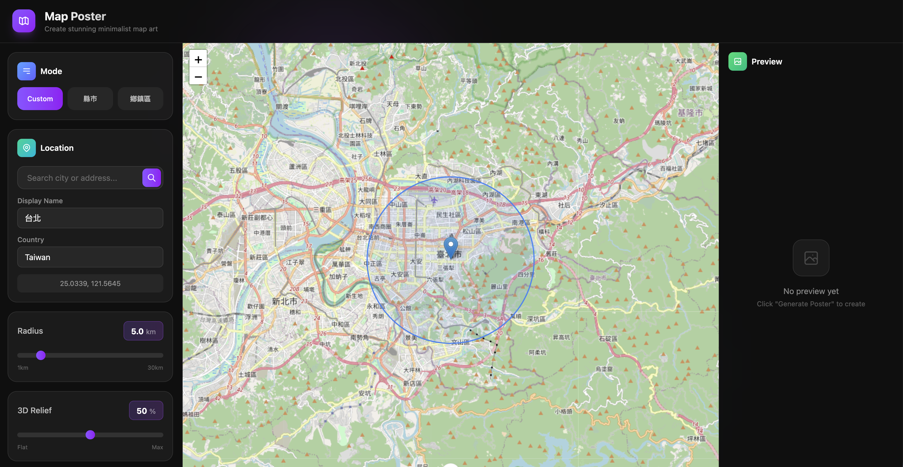
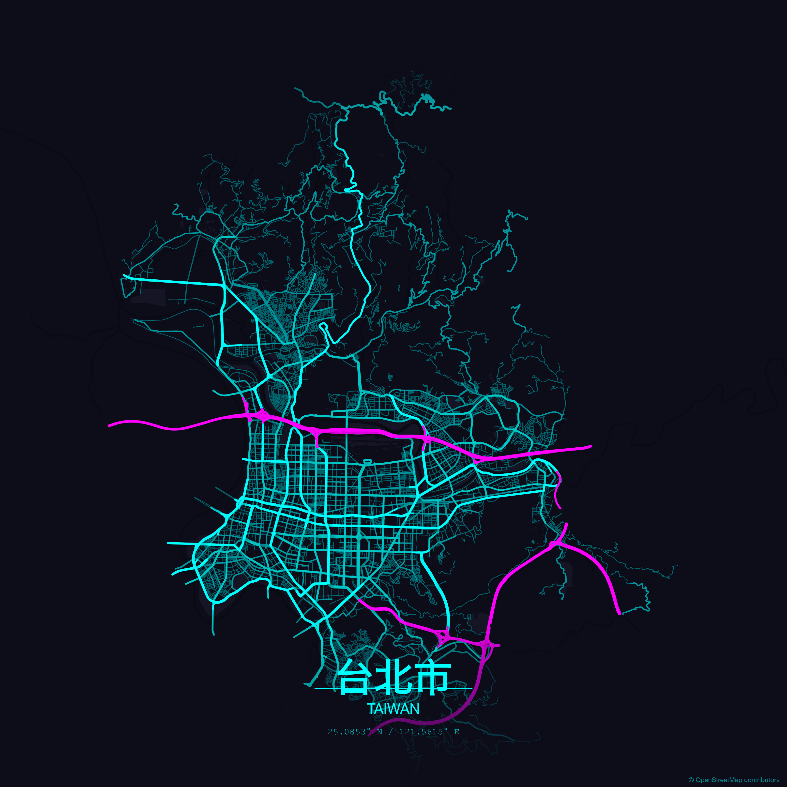
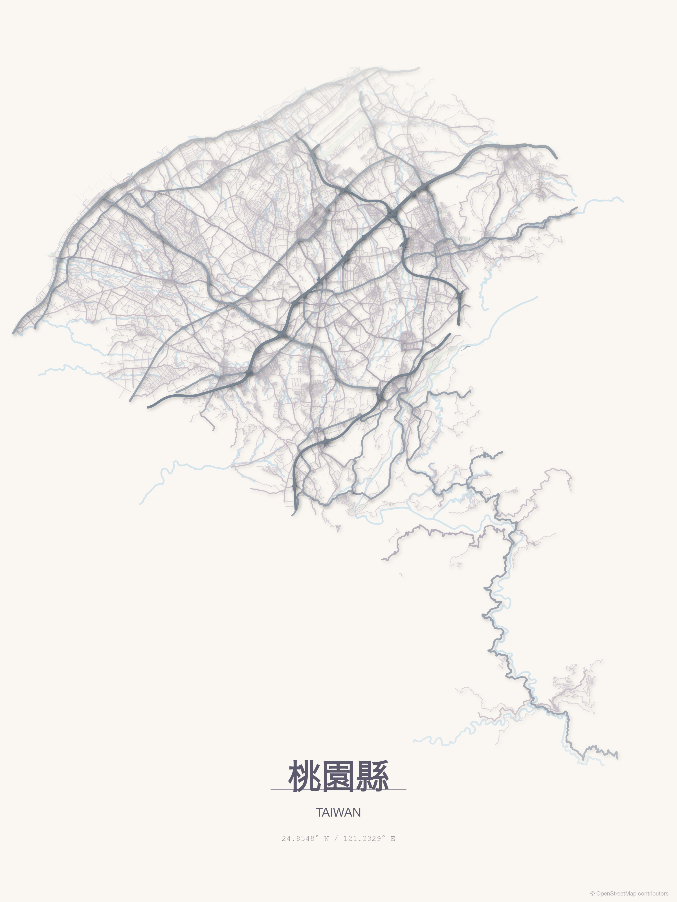
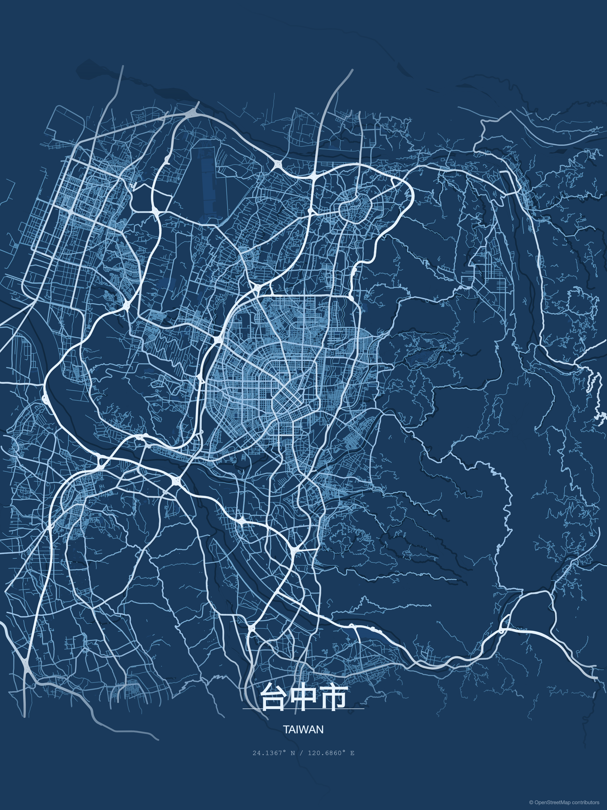

# Map Poster Generator

一個用於生成精美地圖海報的 Nuxt 4 應用程式。支援自訂區域、台灣縣市及鄉鎮市區邊界地圖。



## 功能特色

- **三種模式**
  - **Custom**: 自訂任意地點與半徑範圍
  - **縣市**: 選擇台灣 22 個縣市邊界
  - **鄉鎮區**: 選擇特定鄉鎮市區邊界

- **地圖元素**
  - 道路網絡 (高速公路、主要道路、次要道路、住宅道路)
  - 水域 (河流、湖泊、海灣)
  - 公園綠地

- **自訂選項**
  - 多種預設主題配色
  - 自訂顏色調整
  - 3D 浮雕效果強度
  - 輸出尺寸設定

## 範例作品

| 台北市 | 桃園縣 | 臺中 |
|:---:|:---:|:---:|
|  |  |  |

## 技術架構

### 前端
- **Nuxt 4** - Vue.js 框架
- **TailwindCSS 4** - 樣式框架
- **DaisyUI** - UI 元件庫
- **Leaflet** - 地圖預覽

### 後端
- **@napi-rs/canvas** - 伺服器端圖片繪製
- **Overpass API** - OSM 地圖資料查詢
- **robust-point-in-polygon** - 邊界裁切計算

## 安裝與執行

### 安裝依賴

```bash
npm install
```

### 開發模式

```bash
npm run dev
```

開啟瀏覽器訪問 `http://localhost:3000`

### 生產建置

```bash
npm run build
npm run preview
```

## 資料來源

- **地圖資料**: [OpenStreetMap](https://www.openstreetmap.org/)
- **台灣行政區邊界**: [ronnywang/twgeojson](https://github.com/ronnywang/twgeojson)

## 啟蒙專案

本專案靈感來自 [maptoposter](https://github.com/originalankur/maptoposter)，感謝原作者 Ankur Gupta 的開源貢獻。

## 授權

本專案採用自定義授權，僅允許私人使用與修改程式碼，不允許商業使用或分發。詳見 [LICENSE](LICENSE)。

地圖資料 © OpenStreetMap contributors
